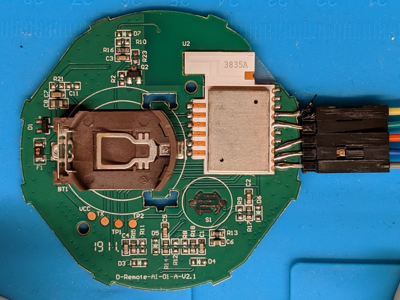

# Gecko Zigbee Python interface

This is a pure Python implementation of a IEEE802.15.4 and ZigBee network stack
that works with MicroPython.

It was developed for the Silicon Labs Gecko boards used in
Ikea Tradfri devices.  The firmware port of MicroPython lives in
[osresearch/micropython/ports/efm32](https://github.com/osresearch/micropython/tree/efm32/ports/efm32).
The underlying ZigBee radio interface also lives in the machine specific
port for that board; this is the hardware agnostic software stack that
processes the packets.

For more information on the project, see [Ikea+Micropython lightning talk](https://trmm.net/Ikea).

# Installing



See the
[README](https://github.com/osresearch/micropython/blob/efm32/ports/efm32/README.md)
in the MicroPython port for details on building and installing using OpenOCD + SWD.

Using [`ampy.py`](https://learn.adafruit.com/micropython-basics-load-files-and-run-code/install-ampy) you can
install all of the code from the `ZbPy` directory into the flash on the device.

# ZigBee network layers

* Phyiscal layer (handled by the radio, supported via `import Radio`)
* IEEE802.15.4: `import ZbPy.IEEE802154`
* NWK - Network Layer: `import ZbPy.ZigbeeNetwork`
* Security Layer (not really a layer, an optional part of the NWK header)
* APS - Application Support Layer: `import ZbPy.ZigbeeApplication`
* ZCL - ZigBee Cluster Library: `import ZbPy.ZigbeeCluster`


Most of the layers are sufficiently implemented to join an
existing Zigbee network, receive a 16-bit short network address,
decrypt+validate and encrypt+mac messages encrypted with the
[AES-CCM mode](https://en.wikipedia.org/wiki/CCM_mode).

The Application and Cluster layers are only partially
implemented right now; the messages are decoded but not
mapped to functionality.
Perhaps parts of [ZigPy](https://github.com/zigpy/zigpy) can be 
ported to MicroPython to provide these mappings.


# Debugging Zigbee

It is easiest to use `zbsniff` in this tree, talking to an
Ikea device on `/dev/ttyACM0`, which will output a PCAP file
on stdout.  You can pipe this to `wireshark` to trace what
is going on:

```
zbsniff | wireshark -k -i -
```

However, there is lots of "noise" in the Zigbee protocol
with repeat messages, acks, etc that make the wireshark
display messy.

Don't display acks: `!(wpan.frame_type == 0x2)`
Don't display repeats: `(!(wpan.frame_type == 0x1) || wpan.src16 == zbee_nwk.src)`
